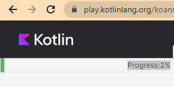

# Домашка до четверга, 17 марта

## Kotlin Koans
Нужно дойти до конца (решить или хотя бы по разу попробовать решить каждую задачу).
Скидывайте [сюда](https://github.com/vshat-tms/lesson16-homework/issues/1) скриншоты вашего прогресса.
Пример скриншота:



## Задачи по этому репозиторию
1. Форкнуть себе этот репозиторий
2. Реализовать указанные ниже команды (на котлине)
3. Сделать пулл реквест в этот репозиторий
4. Если в списке пулл реквестов вы увидите другие пулл реквесты (кроме вашего) - то зайдите в них и напишите "approve" в комментариях, если вы согласны с решением вашего коллеги. Оставьте комментарии к коду, если в чём-то не согласны.

Нужно реализовать указанные ниже команды

### Команда timer
Пользователь вводит целое число от 5 до 10. Если число не указано или вне этого диапазона, то используйте число 5. Нужно отсчитать от указанного числа до нуля. После вывода каждой строки кроме последней (`0`) должна быть пауза в 1 секунду.

Пример ввода:
```
timer 5
```

Пример вывода:
```
5...
4...
3...
2...
1...
0
```
### Команда f_to_c
Пользователь вводит температуру в фаренгейтах (дробное число - `Double`). Нужно перевести его в фаренгейты. Количество символов после запятой в выводе не должно быть больше двух. Если пользователь неправильно ввёл число - нужно вывести ошибку.

Пример ввода:
```shell
f_to_c 15.5
```
Пример вывода:
```text
15.5 ℉ = -9.17 ℃
```

### Команда c_to_f
Делает то же, что и `f_to_c`, только наоборот

Пример ввода:
```shell
c_to_f -9.17
```
Пример вывода:
```text
-9.17 ℃ = 15.49 ℉
```

### Команда fizzbuzz
Выводит на экран числа от 1 до `n` включительно. `n` - целое число от 20 до 100. Если число вне этого диапазона или неверно введено - то сообщите об этом пользователю. 
При этом вместо чисел, кратных трем, программа должна выводить слово Fizz, а вместо чисел, кратных пяти — слово Buzz. Если число кратно пятнадцати, то программа должна выводить слово FizzBuzz.

Пример ввода:
```shell
fizzbuzz 20
```

Пример вывода:
```text
1
2
Fizz
4
Buzz
Fizz
7
8
Fizz
Buzz
11
Fizz
13
14
FizzBuzz
16
17
Fizz
19
Buzz
```
